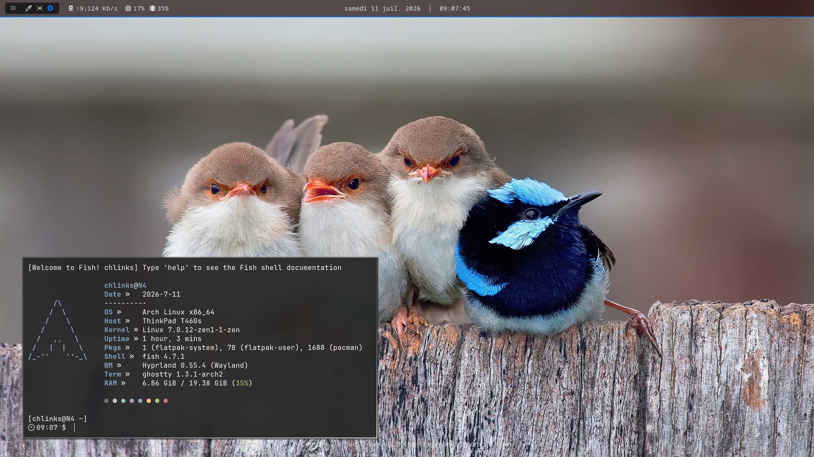

# My Simple Dots

A small and practical dotfiles setup for my daily Arch Linux workflow.

Focused on keeping things simple, clean, and comfortable for everyday use.

## Features

- Automatic wallpaper switching with **hyprpaper**
  - Wallpapers stored in `$XDG_PICTURES_DIR/Wallpapers`
- **Ghostty** configuration with cursor trail effects
- **Fuzzel** application launcher setup
- **fastfetch** system information display
- **Starship** shell prompt configuration
- **Hyprland** compositor configuration
- XDG user directory setup

## XDG Directories

Configured user directories:

```bash
XDG_DESKTOP_DIR="$HOME/Desktop"
XDG_DOWNLOAD_DIR="$HOME/Downloads"
XDG_TEMPLATES_DIR="$HOME/Templates"
XDG_PUBLICSHARE_DIR="$HOME/Public"
XDG_DOCUMENTS_DIR="$HOME/Documents"
XDG_MUSIC_DIR="$HOME/Music"
XDG_PICTURES_DIR="$HOME/Pictures"
XDG_VIDEOS_DIR="$HOME/Videos"
XDG_PROJECTS_DIR="$HOME/Projects"
```

## Installation

This repository uses `stow` to manage symlinks.

Clone the repository:

```bash
git clone <repo-url>
cd <repo-name>
```

Apply the dotfiles:

```bash
make stow
```

## Requirements

- Arch Linux
- Hyprland
- hyprpaper
- fuzzel
- ghostty
- starship
- stow
- fastfetch

That's it.

## Showcase



